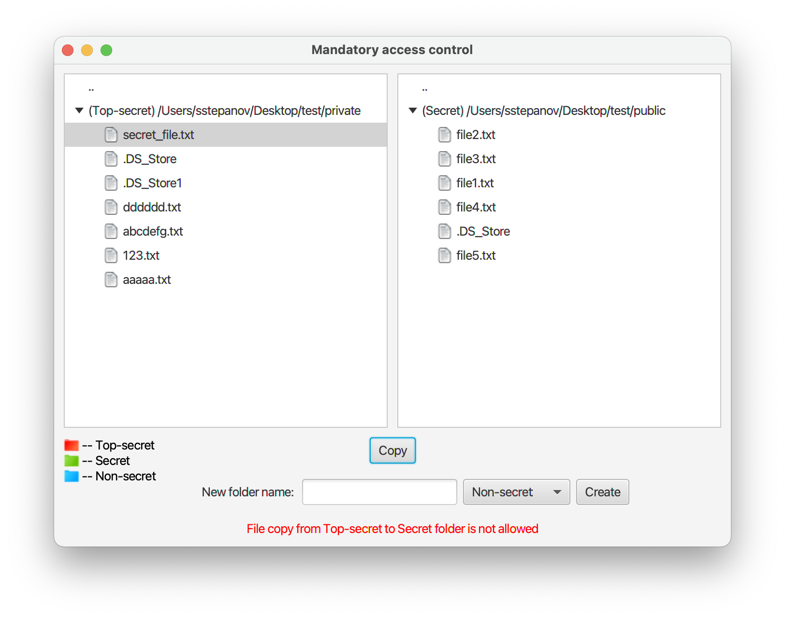

# Mandatory access control

## Steps for launching this application on your computer

First of all, you must have at least `Java 11` installed on your computer.

1. Open terminal
2. Clone the repository into your local filesystem 
    ```shell script
    git clone https://github.com/mainmeatball/university.git
    ```
3. Go into computer systems security models module
    ```shell script
    cd university/computer-systems-security-models/
    ```
4. Build jar using gradle wrapper
    ```shell script
    ./gradlew build
    ```
5. Launch the application
    ```shell script
    java -jar build/libs/mandatory_access_control-1.0.0.jar
    ```
   
## Application screenshots




